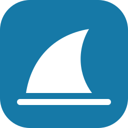
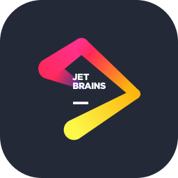

  

### 🧭 Areas of Interest & Development

### **🛡️ Security Focus**
### - _SOC Analyst / Threat Hunter_

### **📈 Areas of Development**
### - _Log analysis & threat detection_
### - _Network traffic analysis_

### 💻 Tech Stack & Tools

### **🧑🏽‍💻 Languages**

  

### **⚒️ Tools**

  
  
  

### **🧰 IDE**

  
  

### **🖥️ Operating Systems**

  

  

